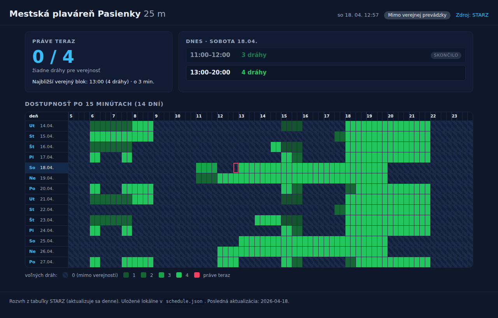

# STARZ Pasienky — dostupnosť dráh

Jednoduchý statický dashboard, ktorý vizualizuje počet voľných dráh pre
verejnosť v 25-metrovom bazéne Mestskej plavárne Pasienky (STARZ Bratislava)
v 15-minútových blokoch na 14 dní dopredu.

Zdroj rozvrhu:
<https://bratislava.sk/vzdelavanie-a-volny-cas/starz/prevadzky-sportoviska/mestska-plavaren-pasienky-25m>

## Ukážka



<details>
<summary>Mobilné zobrazenie</summary>


</details>

## Spustenie

Statická stránka — stačí ju otvoriť cez lokálny HTTP server (kvôli
`fetch("schedule.json")`):

```
python3 -m http.server 8000
# a v prehliadači: http://localhost:8000
```

## Ako aktualizovať rozvrh

STARZ publikuje tabuľku „Počet voľných dráh“ po 15-minútových blokoch.
Dáta sa ukladajú do [`schedule.json`](./schedule.json) v tvare:

```json
{
  "slotMinutes": 15,
  "dayStart": "05:00",
  "dayEnd": "24:00",
  "maxLanes": 4,
  "days": [
    { "date": "2026-04-18", "weekday": "sobota",
      "free": [0, 0, /* … 76 hodnôt, 05:00–23:45 … */ 0] }
  ]
}
```

Každý deň má 76 hodnôt (19 hodín × 4 bloky). Hodnota = počet dráh voľných
pre verejnosť v danom bloku, 0 znamená mimo verejnej prevádzky.

## Funkcie

- Karta **Práve teraz** s počtom voľných dráh pre aktuálny 15-min blok.
- Čas do konca prebiehajúceho bloku, resp. čas do najbližšieho verejného bloku.
- Zoznam dnešných verejných blokov s označením prebiehajúce / skončilo.
- **Heatmapa** 14 dní × 76 blokov s farbou podľa počtu voľných dráh,
  zvýraznený dnešný riadok a aktuálna bunka.
- Automatická obnova každých 30 s.

## Súbory

- `index.html` — rozloženie stránky.
- `styles.css` — štýly.
- `app.js` — načítanie dát a render.
- `schedule.json` — údaje rozvrhu.
- `docs/` — snímky pre README.
