# STARZ Pasienky — voľné dráhy

<p align="center">
  <a href="https://dscibrany.github.io/starzpools/"></a>
</p>

> ### [Otvoriť živý dashboard &rarr;](https://dscibrany.github.io/starzpools/)

Jednoduchý statický dashboard, ktorý vizualizuje počet voľných dráh pre
verejnosť v Mestskej plavárni Pasienky (STARZ Bratislava) v 15-minútových
blokoch na 14 dní dopredu. Podporuje **25 m aj 50 m bazén**.

Zdroje:
- 25 m bazén: <https://bratislava.sk/vzdelavanie-a-volny-cas/starz/prevadzky-sportoviska/mestska-plavaren-pasienky-25m>
- 50 m bazén: <https://bratislava.sk/vzdelavanie-a-volny-cas/starz/prevadzky-sportoviska/mestska-plavaren-pasienky-50m>
- Cenník (PDF): <https://bratislavask.s3.bratislava.sk/upload/2025_Mestska_Plavaren_Pasienky_Cennik46_9a43ab7401.pdf>

## Ukážka

<details open>
<summary>50 m bazén (predvolený)</summary>

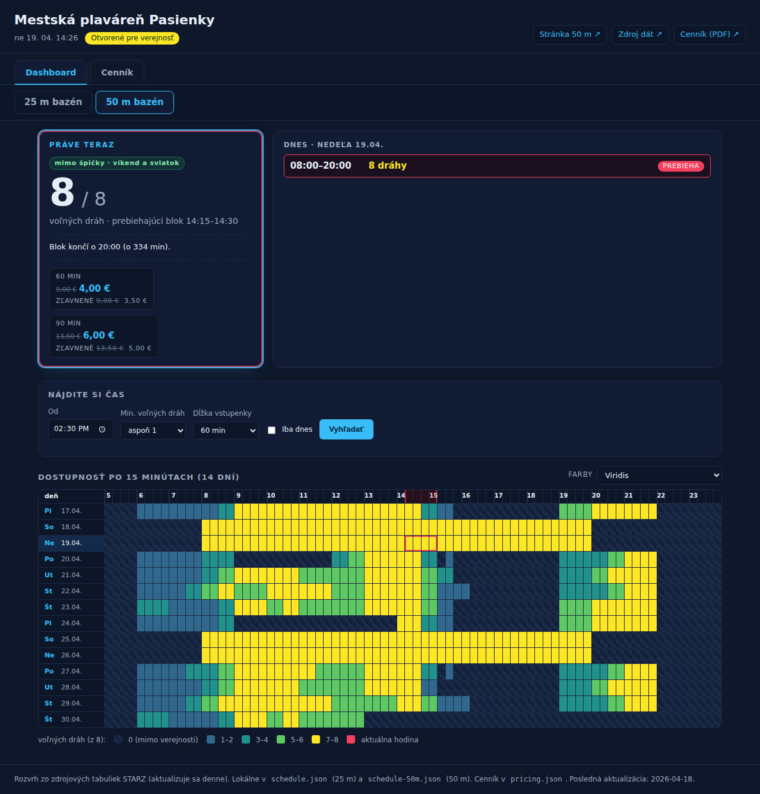

</details>

<details>
<summary>25 m bazén</summary>

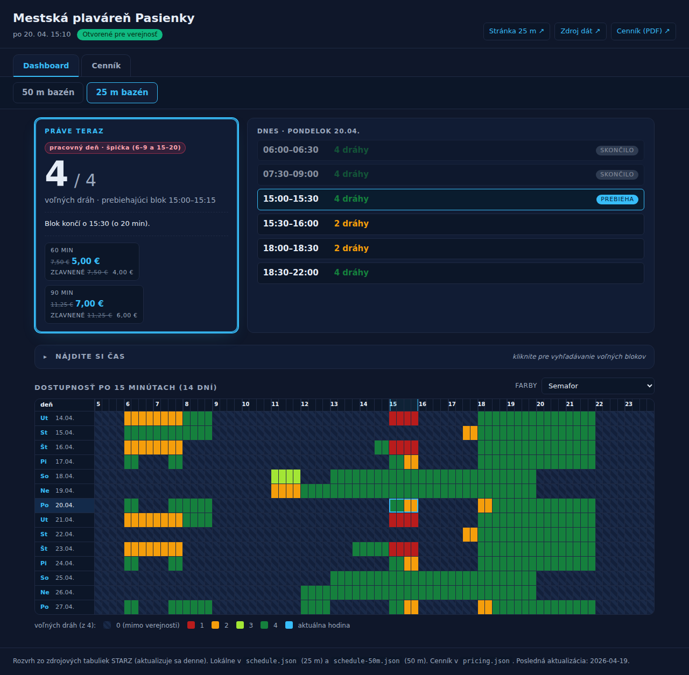

</details>

<details>
<summary>Farebné témy heatmapy</summary>

Téma sa prepína vpravo nad heatmapou a ukladá sa do `localStorage`.

| Semafor (predvolená) | Viridis |
|---|---|
| 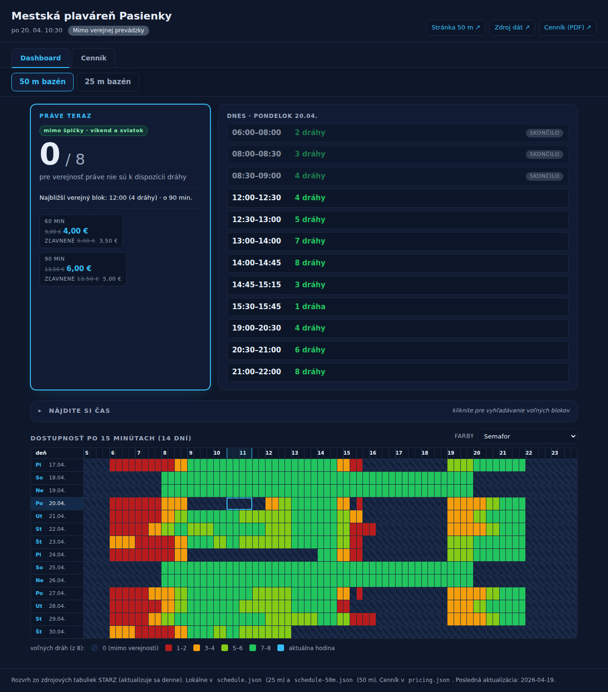 | 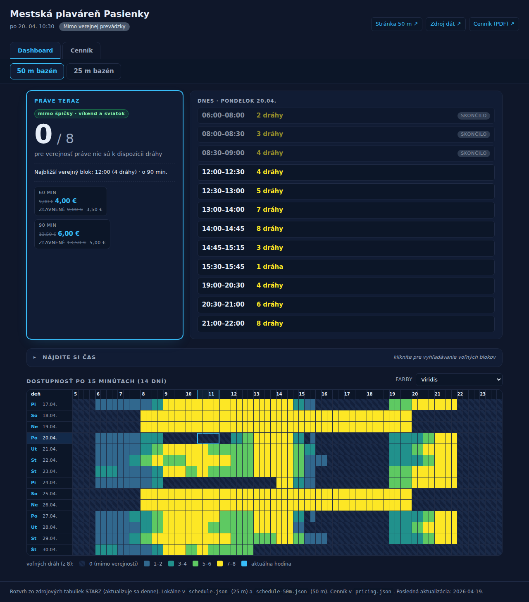 |

| Modrá (monochromatická) | Rozhranie 50 % |
|---|---|
| 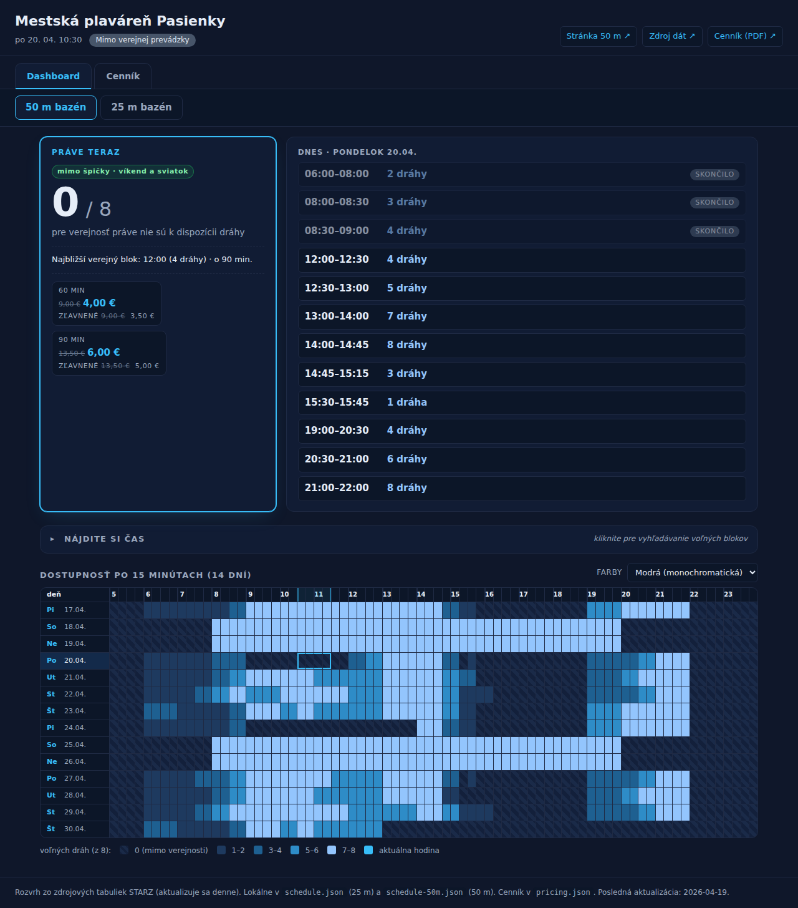 | 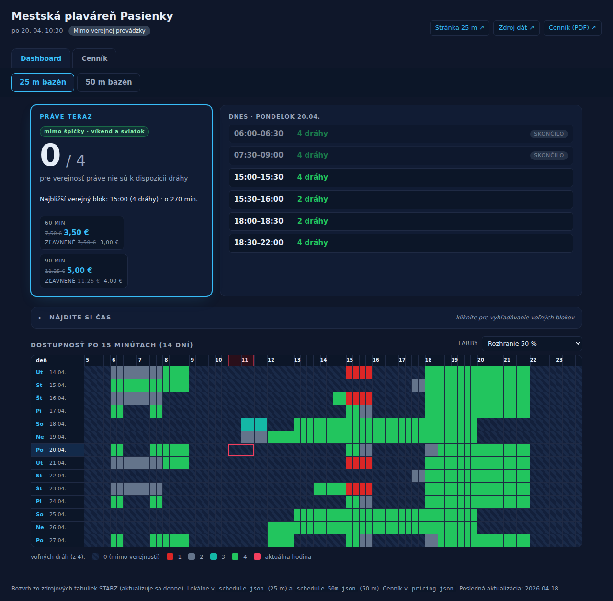 |

</details>

<details>
<summary>Vyhľadávač („Nájdite si čas“)</summary>

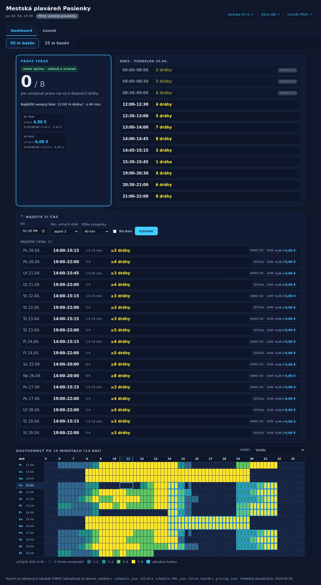

</details>

<details>
<summary>Cenník</summary>

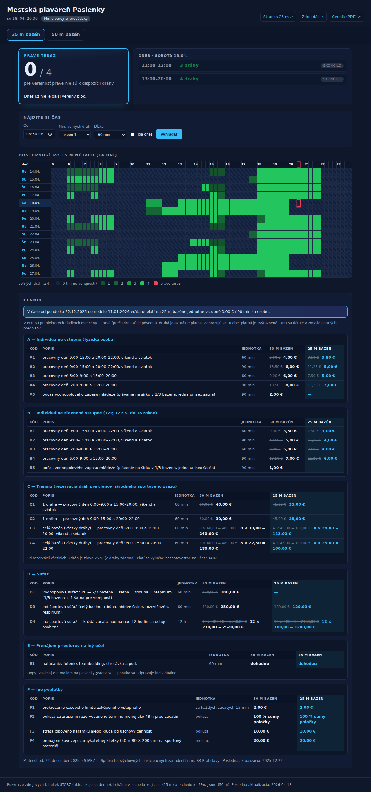

</details>

<details>
<summary>Mobilné zobrazenie</summary>

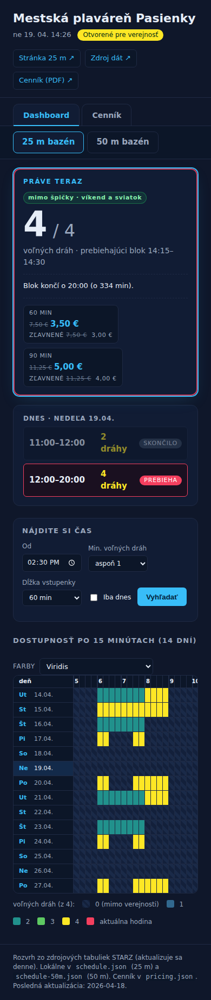

</details>

<details>
<summary>Indikácia neaktuálneho cenníka</summary>

Keď sa SHA-256 aktuálneho PDF cenníka na stránke bazéna líši od uloženej
referenčnej kópie (alebo keď link už nie je dostupný), dashboard:

- zobrazí žltý pruh nad obsahom,
- označí ⚠ každú cenovku v karte „Práve teraz" a vo výsledkoch vyhľadávača,
- označí ⚠ každú bunku s cenou v tabuľke cenníka.

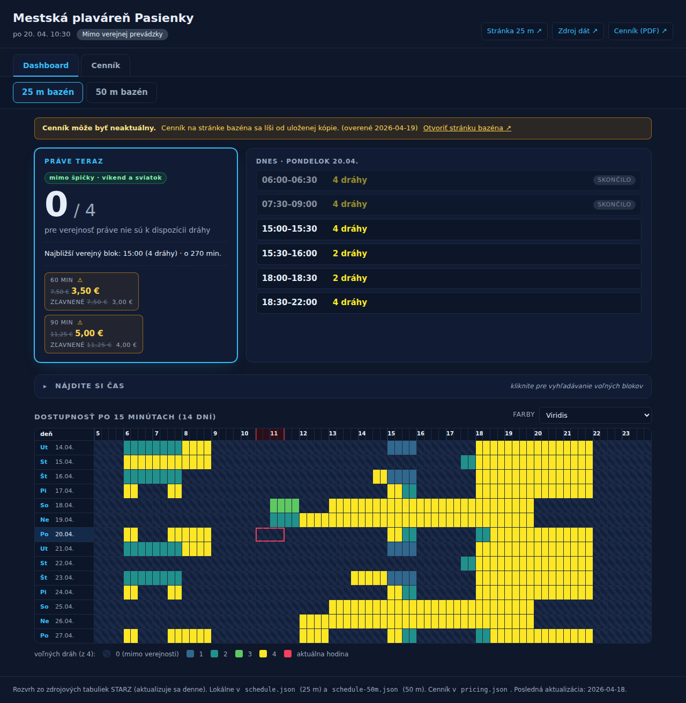

Vyhľadávač — každý výsledok má žltú cenovku s ⚠:

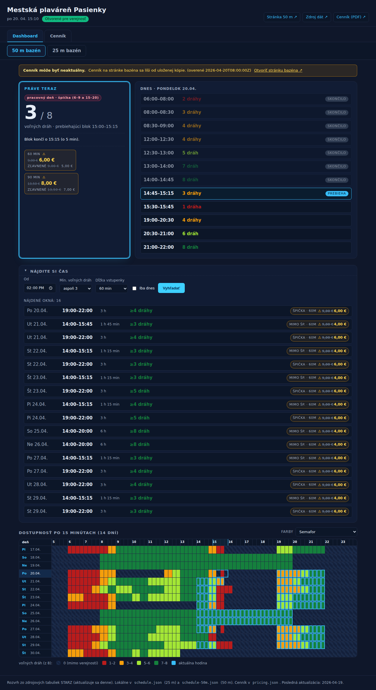

Cenník — každá bunka má ⚠:

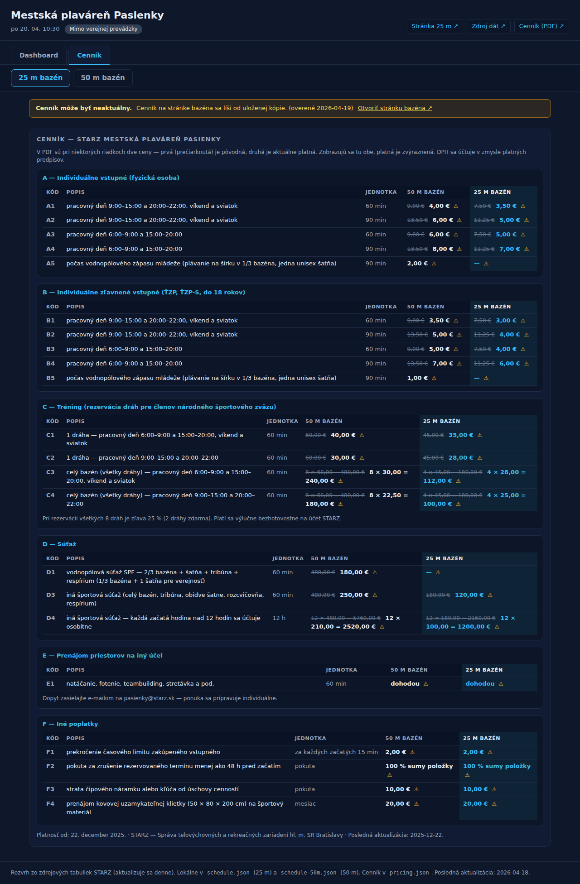

</details>

## TODO

Otvorené nápady na ďalšie iterácie — nič z toho nie je blokujúce, slúži
to len ako zoznam vecí, ktoré dávajú zmysel, ak sa projekt bude rozvíjať.

- [x] ~~**PWA** — `manifest.json` + service worker, aby sa dala stránka
      „pridať na plochu" a fungovala offline s poslednými staženými dátami.~~
      (hotovo — nazvaná **STARZ Pools**, ikony v `icons/`, `sw.js` so
      cache-first stratégiou pre statické assety a network-first pre JSON.)
- [ ] **Obľúbené sloty** — uložené do `localStorage`, s indikátorom pri
      riadku v heatmape a v karte „Dnes".
- [ ] **Export do kalendára** — tlačidlo „Pridať do kalendára" pri
      každom bloku/výsledku vyhľadávača (`.ics` link).
- [ ] **Upozornenia** — opt-in web push, keď sa uvoľní vopred zvolený slot
      (napr. „utorok 18:00, aspoň 3 dráhy").
- [ ] **Anglická verzia** — jazykový prepínač (sk/en), texty vytiahnuté
      do `i18n.json`.
- [ ] **Trend obsadenosti** — tab/panel s priemerom voľných dráh po
      hodinách/dňoch za posledných N týždňov (vyžaduje archiváciu
      `schedule.json` snapshotov).
- [ ] **Robustnosť scrapera** — ak sa zmení štruktúra zdrojového
      XLSX/HTML, dashboard by mal zobraziť banner „dáta môžu byť
      neaktuálne" (podobne ako pri cenníku).
- [ ] **Ďalšie STARZ bazény** — Rosnička, Delfín, Tehelné pole; rovnaký
      formát `schedule*.json`, len s iným pool-tabom.
- [ ] **A11y audit** — ARIA role pre heatmap-cells, klávesová navigácia
      po bunkách, kontrast tmavých farieb v Semafore.
- [ ] **Zdieľanie odkazu** — URL s parametrami `?date=…&from=…&lanes=…`,
      ktorá otvorí dashboard s predvyplneným vyhľadávačom.
- [ ] **Print/share karta** — „dnešný plán" ako jedna obrazovka
      optimalizovaná na screenshot do chatu.
- [ ] **Automatické mazanie stale Pages environment branches** — keď
      workflow deploynutia spadne, aktuálne treba manuálne upratať
      deployment-branch rule.

## Funkcie

- **Prepínač bazénov** 25 m / 50 m.
- **Karta „Práve teraz“** — výrazne zvýraznená, pulzujúce orámovanie počas
  prebiehajúceho verejného bloku, počet voľných dráh, kedy blok končí alebo
  kedy začne najbližší verejný blok.
- **Vyhľadávač voľných blokov** — nastavte najskorší čas, minimálny počet
  dráh a minimálnu dĺžku, dashboard vyhľadá všetky vyhovujúce okná a zvýrazní
  ich v heatmape.
- **Heatmapa 14 dní × 76 blokov** — farba podľa pomeru voľných/celkových
  dráh (4 úrovne + zatvorené), zvýraznený dnešný riadok a aktuálny stĺpec.
- **Externé odkazy** — tlačidlá na oficiálnu stránku vybraného bazéna, na
  zdrojovú tabuľku STARZ a na PDF cenník.
- **Cenník** — karta s cenami (doplňte hodnoty do `pricing.json`).
- Automatická obnova každých 30 s.

## Spustenie

Statická stránka — stačí ju otvoriť cez lokálny HTTP server (kvôli
`fetch("schedule.json")`):

```
python3 -m http.server 8000
# otvorte http://localhost:8000
```

## Nasadenie (GitHub Pages)

Repozitár má pripravený workflow
`.github/workflows/pages.yml`, ktorý po každom pushi do `main` nasadí
obsah repozitára na GitHub Pages. Stačí v repo **Settings → Pages**
zvoliť **Source: GitHub Actions** — ďalšie nastavenia netreba.

Výsledná URL má tvar `https://<user>.github.io/starzpools/`. Denný
workflow `update-data.yml` commituje čerstvé JSON-y do `main`,
čo automaticky spustí redeployment.

## Súbory

| Súbor | Obsah |
|---|---|
| `index.html` | rozloženie stránky |
| `styles.css` | štýly (tmavá téma) |
| `app.js` | načítanie dát, render, vyhľadávač |
| `schedule.json` | údaje 25 m bazéna |
| `schedule-50m.json` | údaje 50 m bazéna |
| `pricing.json` | cenník |
| `docs/` | snímky pre README |

## Dátový formát rozvrhu

Každý súbor `schedule*.json` má rovnakú štruktúru:

```json
{
  "pool": "…",
  "source": "https://…",
  "updated": "YYYY-MM-DD",
  "slotMinutes": 15,
  "dayStart": "05:00",
  "dayEnd": "24:00",
  "maxLanes": 4,
  "days": [
    {
      "date": "2026-04-18",
      "weekday": "sobota",
      "free": [0, 0, /* … 76 hodnôt … */ 0]
    }
  ]
}
```

Každý deň má **76 hodnôt** (19 hodín × 4 bloky po 15 minút, 05:00–23:45).
Hodnota = počet dráh voľných pre verejnosť v danom bloku, `0` = mimo
verejnej prevádzky.

Aktualizácia rozvrhu: skopírujte z oficiálnej STARZ tabuľky „Počet voľných
dráh“ hodnoty pre daný deň a vložte ich do `free`.

## Cenník

`pricing.json` obsahuje sekcie s položkami. Prázdny `price` sa zobrazí ako
„— doplňte —“. Doplňte reálne ceny z oficiálneho PDF cenníka.
